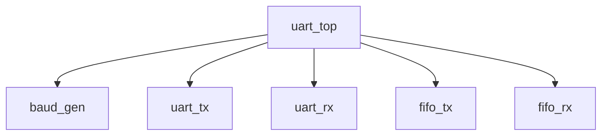

# UART Controller with FIFO Buffers


## Table of Contents
- [Features](#features)
- [Module Hierarchy](#module-hierarchy)
- [Block Diagram](#Block-diagram)
- [Parameters](#parameters)
- [Interface Signals](#interface-signals)
- [Simulation with Icarus Verilog](#simulation-with-icarus-verilog)
- [Synthesis Notes](#synthesis-notes)
- [Configuration Examples](#configuration-examples)
- [License](#license)

## Features

**Core Functionality**:
- Full-duplex UART communication
- Configurable baud rate via divisor input
- Integrated FIFO buffers for both TX and RX paths

**Parameterization**:
- Data width: 5-9 bits (default 8)
- Stop bit sampling rate (default 16x)
- FIFO depth: Configurable as 2^N entries

**Error Handling**:
- TX FIFO full flag (`tx_full`)
- RX FIFO empty flag (`rx_empty`)

## Module Hierarchy



## Block Diagram

graph TD
    %% Clock and Baud Rate Generation
    clk --> BRG["baud rate generator"]
    BRG -->|tick| TX["transmitter"]
    BRG -->|s_tick| RX["receiver"]
    
    %% Transmitter Section
    TX -->|tx| TX_OUT["tx (serial out)"]
    TX -->|tx_done_tick| TX_FIFO
    TX_FIFO["FIFO (TX)"] -->|w_data| TX
    TX_FIFO -->|wr| WR_TX["wr_uart (input)"]
    TX_FIFO -->|full| STATUS_TX["tx_full (status)"]
    
    %% Receiver Section
    RX_IN["rx (serial in)"] --> RX
    RX -->|dout| RX_FIFO["FIFO (RX)"]
    RX -->|rx_done_tick| RX_FIFO
    RX_FIFO -->|r_data| DATA_OUT["r_data (output)"]
    RX_FIFO -->|rd| RD_RX["rd_uart (input)"]
    RX_FIFO -->|empty| STATUS_RX["rx_empty (status)"]

## Parameters

| Parameter         | Default | Description                     |
|-------------------|---------|---------------------------------|
| `DBIT_WIDTH`      | 8       | Data bits per frame (5-9)       |
| `SB_TICK`         | 16      | Oversampling ticks per bit      |
| `FIFO_DEPTH_BITS` | 2       | FIFO depth = 2^N entries        |

## Interface Signals

### System Control
| Signal  | Direction | Description          |
|---------|-----------|----------------------|
| `clk`   | Input     | System clock         |
| `rst`   | Input     | Active-high reset    |

### Data Interface
| Signal      | Direction | Description                |
|-------------|-----------|----------------------------|
| `wr_uart`   | Input     | Write strobe for TX FIFO   |
| `rd_uart`   | Input     | Read strobe for RX FIFO    |
| `w_data`    | Input     | Data to transmit           |
| `r_data`    | Output    | Received data              |
| `tx_full`   | Output    | TX FIFO full flag          |
| `rx_empty`  | Output    | RX FIFO empty flag         |

### Physical Layer
| Signal | Direction | Description        |
|--------|-----------|--------------------|
| `tx`   | Output    | Serial transmit    |
| `rx`   | Input     | Serial receive     |

### Configuration
| Signal | Direction | Description                |
|--------|-----------|----------------------------|
| `dvsr` | Input     | Baud rate divisor          |

## Simulation with Icarus Verilog

### 1. Installation

**Linux:**
```bash
sudo apt-get install iverilog gtkwave
```

**MacOS:**
```bash
brew install icarus-verilog gtkwave
```

**Windows:**  
Download from [iverilog.icarus.com](http://iverilog.icarus.com)

### 2. Compilation & Simulation

```bash
# Compile all modules
iverilog -o uart_sim     uart_top.v     uart_tx.v     uart_rx.v     baud_gen.v     fifo.v     tb_uart.v

# Run simulation
vvp uart_sim

# View waveforms (if VCD generated)
gtkwave dump.vcd &
```

### Example Testbench

```verilog
module tb_uart;
    reg clk = 0;
    reg rst = 1;
    
    uart_top dut (.*);
    
    always #5 clk = ~clk;
    
    initial begin
        #20 rst = 0;
        
        // Test transmission
        @(negedge clk);
        dut.w_data = 8'h55;  // Send 'U'
        dut.wr_uart = 1;
        @(negedge clk);
        dut.wr_uart = 0;
        
        // Check reception
        wait(dut.rx_empty == 0);
        $display("[RX] Data: 0x%h", dut.r_data);
        
        #100 $finish;
    end
endmodule
```

## Synthesis Notes

### Xilinx FPGA Constraints Example
```tcl
create_clock -period 20.000 -name clk [get_ports clk]

set_property PACKAGE_PIN F3 [get_ports tx]
set_property PACKAGE_PIN F4 [get_ports rx]
set_property IOSTANDARD LVCMOS33 [get_ports {tx rx}]
```

## Configuration Examples

### 9600 Baud @ 50MHz
```verilog
uart_top #(
    .FIFO_DEPTH_BITS(3)  // 8-entry FIFO
) my_uart (
    .dvsr(5208),  // 50MHz/9600
    .tx(serial_tx),
    .rx(serial_rx)
    // ... other connections
);
```

### 115200 Baud @ 100MHz
```verilog
uart_top #(
    .FIFO_DEPTH_BITS(4)  // 16-entry FIFO
) my_uart (
    .dvsr(868),  // 100MHz/115200
    // ... other connections
);
```

## License

MIT License. Free for academic and commercial use.